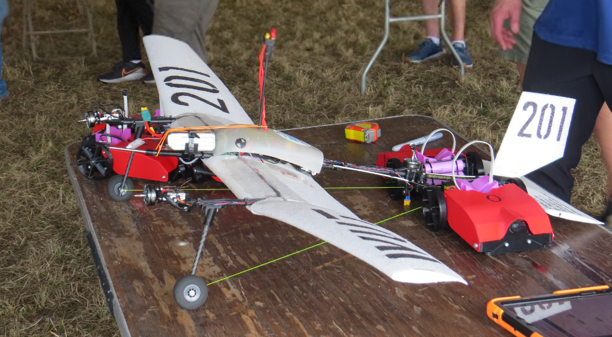

## What I'm trying to achieve

Meet the rest of the avionics team, get a clearer picture of the existing
stack, and pick up any new information to bake into the into the
options document I'm creating.

## Meeting 

**Attendees:** All avionics members, roughly ten people.

Most of this was a repeat of the first general onboarding. The new things
worth keeping:

- Autopilot logic is C on an RTOS. Summer's goal is to refactor it with
  better coding practices.
- "We don't really work with the micro plane anymore."
- East vs. west competition is lottery based now, but because we placed
  last year we get to pick where we want to go.
- Last year: 1st in mission, 2nd overall, but the design report was weak.
  Micro got 1st in presentation and 2nd in design report yet finished
  4th or 5th overall. The presentation and report process is worth
  learning from them.
- **Delivery is locked in over release.** This means flight one cannot
  capture (nothing on the DLZ yet) and the last flight must leave a
  payload behind. 
- The avionics stack is the flight controller and powerboard mounted
  together. Powerboard handles everything except the motors. STM32 based.
- Communications: tasks tracked on GitHub, biweekly meetings with Ella.

## Payload direction

- Omnidirectional docking is preferred: any approach angle, self-centring
  on contact.
- Compact, but the shape depends on plane geometry. One option being
  explored is a fuselage-less plane, where the payload itself becomes
  significant for aerodynamics. Airfoils is teaching Fuse to use Ansys.
- Found a relevant build from a Polish university with a self-centring harness approach:

## Driving questions

- What does an optimal delivery schedule look like across all flights?
- How can the payload be designed to self-align on capture?

## Next

- Look into STM32CubeIDE.
- Continue building out the payload options document.
