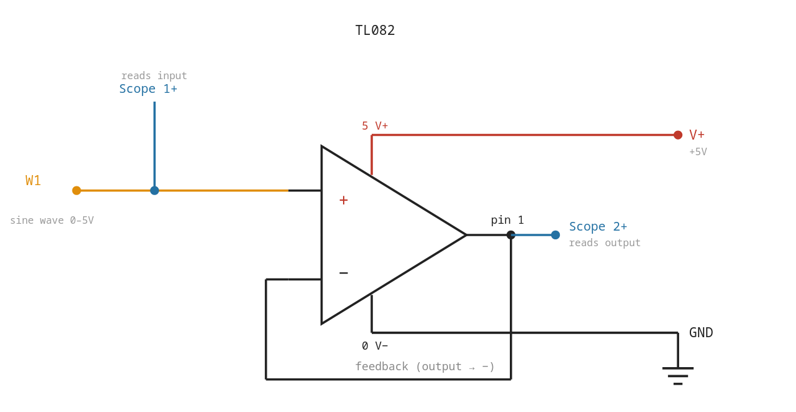
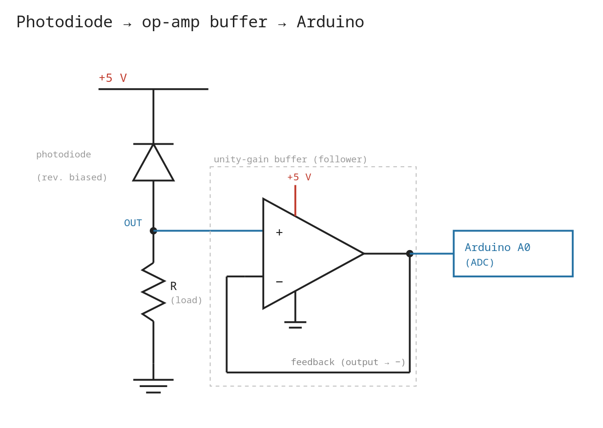
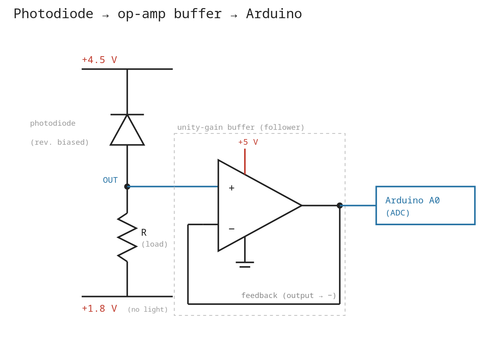

## What I'm trying to achieve

Today I want to build a simple circuit to detect IR using a photodiode.

## Building the circuit

We start by characterizing the opamp I will be using.

The datasheet I found for the [TL082](https://www.ti.com/product/TL082) is a bit hard to understand, so I want to test the input ranges myself to see what analog outputs my photodiode is allowed to give.

I built this circuit:

Running it with a sine wave input gave me this result:

<video src="/videos/opampstrangeness.mp4" muted controls style="max-height:400px; object-fit:cover"></video>

I don't quite understand what's happening... particularly what is going on with that spike to 1.6V, then surprising saturation at the output pin once my input pin is sufficiently low enough. I must explore more.

### The TL082IP

This is the opamp I have right now. According to the datasheet:

| PARAMETER | |  | MIN | TYP | MAX | UNIT |
|---|---|---|---|---|---|---|
| V_CM | Common-mode voltage range | | ±11 | -12 to 15 | | V |

The common-mode (with assumed rails at -15 V and 15 V) is -12 V to 15 V... This means, roughly, we should expect "normal" behaviour around 3 V to 5 V on our input rail. 
We're seeing something like a phase-reversal, which is apparently a common failure mode for these opamps.

In any case, now that we have a profile of this opamp operating at this supply range, we can carry on.

### The circuit we're aiming for

Today I will be building this circuit:

But... because of what we just learned about phase-reversal, we need to bias our `OUT` to operate within ~1.6 V to 4.5 V. So, I'll be building this:

And in order to do this... I will need to use the second opamp in the TL082IP IC. I need to make a voltage divider and take the floppy output, run it through a unity-gain opamp and use this as the reference floor to my photodiode circuit.

(This will make more sense tomorrow when I have images for you.)

## Driving questions

- Is there any interference from one opamp that will impact the other on the TL082IP opamp?
- How should I build this circuit to reduce wire-clutter?

## Next

- Move to the project lab and build the stiff supply!
- Create the *test outside* test-plan to get good baselines on the sun.
