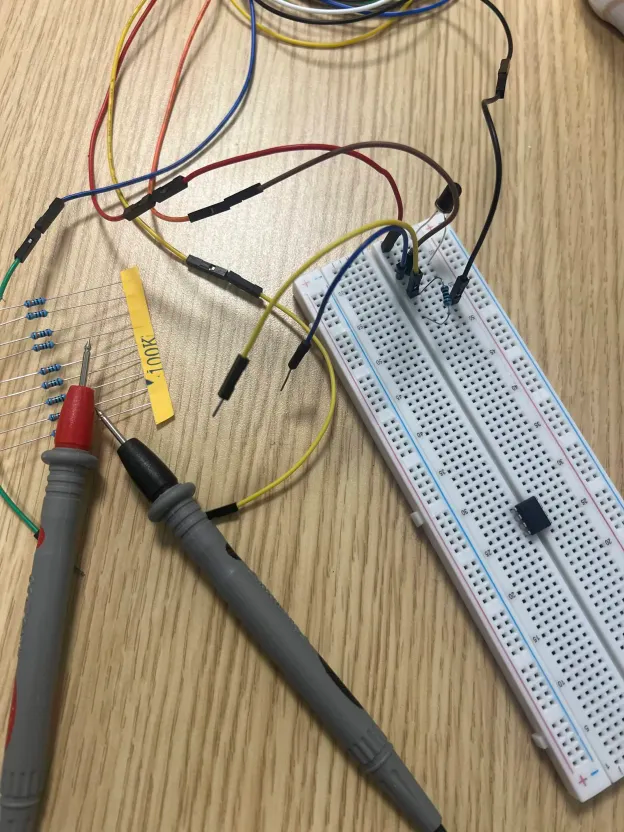

## What I'm trying to achieve

Carrying on, I'd like to get a really clean IR detection circuit going.

## What's the deal with photodiodes? 

The photodiode module I have is a generic 5mm black-tipped photodiode. 
Allegedly, these act like current sources. 
This means: regardless of the voltage used to drive them, light is what controls the current it sends out.
I want to test this out to make sure.

I'm going to place the diode in series with a resistor and measure the current it emits.
The current should only change with varying light, not the value of the resistor after it.

Something very strange is happening. 
At 100 kOhms, my multimeter saw a current of ~43 mA, whereas at 100 Ohms, it saw ~127 mA... Something sinister is going on.

Am I... working with a phototransistor right now???

1. Multimeter in diode mode showed 0L in both directions (a diode would show some voltage drop on forward-bias).
2. Photodiodes can't leak that much current through them...

It seems I'm operating at extreme ranges with 100 kOhms and 100 Ohms respectively. I'm either saturating the phototransistor when the resistance is large, or operating in a sort of dead area when the resistance is too small...

### Troubles along the way:

- My standard multimeter can only detect AC current at around 60 Hz... I only had an AC source for the IR emission at the time... I had to build something DC quickly.

## Let's reset... this is getting out of hand

Assuming I really have a phototransistor, all that's different is that the current is now being magnified to a much higher degree.

When the resistor after the transistor is large, the transistor cannot supply a large current, or it will exceed the voltage of the power rails which provide the flux of electrons. When the resistor after the transistor is small, the transistor is free to push large currents, up to what it's maximally rated to push. The maximum rating will require reading datasheets.

Now, there is one caveat to consider in both large and small resistance conditions. First, when there is sufficient light supply, the transistor will emit as much current as it can (again, limited only by the resistance). Second, when there is insufficient light (such as pure darkness), the transistor will not be able to emit any current, regardless of the resistance you pick.

However, we should note that the resistance after your transistor can shape the environment of light you're expecting. For instance, it may be the case that you are comfortable picking a very large resistance, such that you are very sensitive to changes in light. You may very well encounter a situation where the current times the resistance you pick (although a large resistance) never reaches the ceiling (your power rail), in which case you are operating in a healthy region with no compression.

Knowing this information, we have to consider what the transistor is actually doing, and why it behaves this way. We can say that both photodiodes and transistors are attempting to be ideal current sources. When operating after a power rail, they essentially act like glorified pipes, which take electrons from their source (the power rails), then, with special configurations of crystal lattices and junctions, produce current at a fixed rate, depending only on the light they are able to see.

Careful readers will note this implies something very important: if your resistance is sufficiently low (so as to allow the transistor to output the maximum current it possibly can without using up its allowance from the power source), lowering your resistance further will not change the current it emits. This is what was causing the current to increase so drastically when the resistance was so low. The transistor's role-playing as an ideal current source was limited by the large resistance and the voltage supply. (The large resistance was compressing the transistor.) In another test with a smaller resistance, the transistor was free to output exactly what it could (roughly 200 uA).

To verify this, I will test one more time across a different spectrum of smaller resistances. I expect the current to remain the same, provided the resistances I use are all sufficiently low enough to let the "current source" keep playing its role.

### Please let me say I actually understand what's happening.

| Resistance | Voltage | Current |
|------------|---------|---------|
| 2317 Ω     | 580 mV  | 218 µA  |
| 1471 Ω     | 400 mV  | 227 µA  |
| 432 Ω      | 160 mV  | 239 µA  |
| 100 Ω      | 80 mV   | 241 µA  |
| 22 Ω       | 60 mV   | 245 µA  |

No dude... why is the current increasing? We're nowhere near the saturation...
Oh right... these aren't ideal current sources lol.

## Driving questions

- Is anyone actually reading my explanation of these things... I could polish this up a little, particularly my usage of the word "very" which I seem to have used a lot here...
- What happens when I try using new phototransistors? should I assume they operate in the same resistive region or retest? 

## Next

- Set up that buffer!
