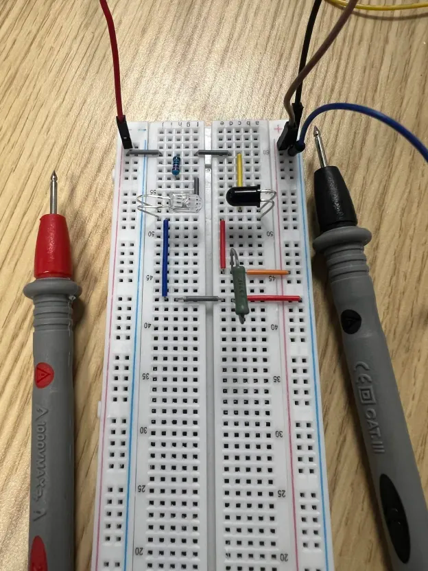
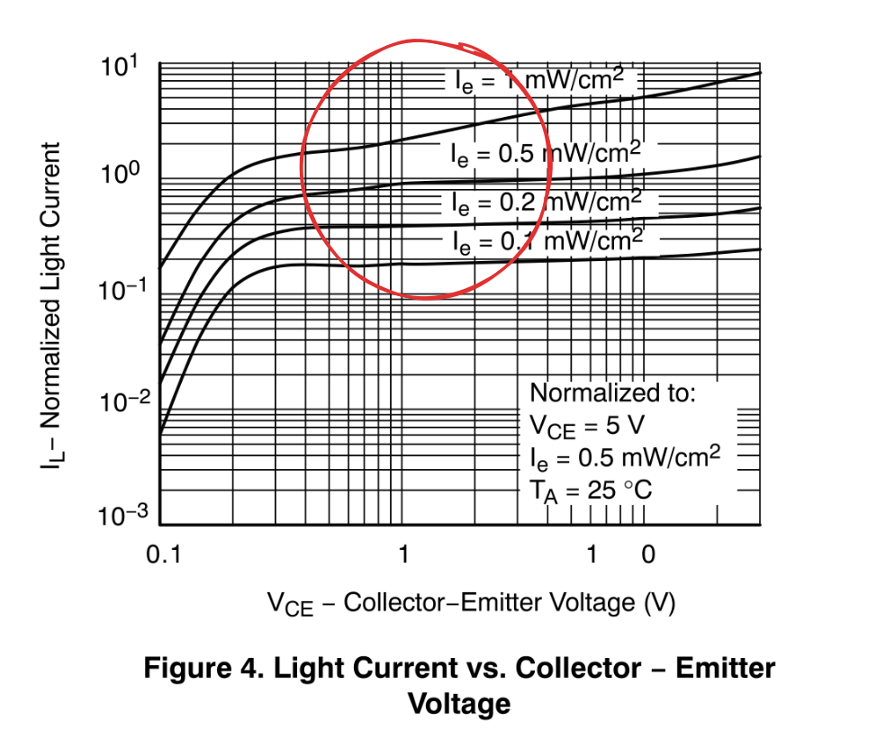

## What I'm trying to achieve

Today I want to fully complete the IR detection system:
1. Analog reading of at least two phototransistor outputs
2. No saturation in indoor lighting at a distance of 2 metres
3. No IC limits causing strange behaviour
4. Compact setup with clean wiring

If I can achieve this today, I will be successful in using it to navigate tomorrow.

## The table from yesterday... again!

I got these new phototransistors and I want to be sure that they operate the same way the one I had yesterday does. This should be very quick now that I know what to look for, and this time I will be testing a series of resistances well beyond 2 kΩ.

### Results

| Resistance | Voltage | Current |
|------------|---------|---------|
| 2370 Ω | 4.86 V | ~2 mA |
| 1470 Ω | 4.83 V | ~3.26 mA |
| 432 Ω | 4.7 V | ~10.86 mA |
| 295 Ω | 4.17 V | ~13.83 mA |
| 197 Ω | 3.4 V | ~16.85 mA |
| 149 Ω | 2.89 V | ~18.7 mA |
| 100 Ω | 2.2 V | ~20.8 mA |
| 22 Ω | 680 mV | ~24.4 mA |

Oh interesting... it looks like we're witnessing a new effect here compared to yesterday.
Notice now, the voltage across the resistor is slightly dropping which implies the changing voltage across the transistor is influencing the current it outputs (even while in the healthy region I described yesterday).

Luckily this time I have the datasheet for these new transistors.

Brilliant, in the region I've highlighted, you can see the light current actually changes pretty aggressively as the V_CE increases. This is why we see much higher currents at lower resistances (even below 432, where we are clearly in the healthy region). Yesterday's phototransistor was behaving a little less sensitively... but it was also emitting a much lower current.

## Time to build

Ok! Using the table above, we can confirm that the most optimal resistor value to use is around 432 Ω. This is where the phototransistor saturates at point blank, and very nicely drops off with the square of distance. The math is showing something a little strange:

4.7 V at 3 cm stretched to 8 ft (~244 cm):

V(8 ft) ≈ 4.7 V × (3 cm / 244 cm)² ≈ 0.71 mV

This value is actually too small for the ADC on the Uno to read, which means around the worst case for the payload on the DLZ, the payload might not be able to detect where it needs to go. This is fine for now (in the future we will likely have a "long range" detection system before transitioning into the fine details).

It's also very likely the math is not exactly representative of the reality so I will just test this empirically.

### The IR source

This whole time in testing I have been using a custom little IR LED powered at 5 V with a 220 Ω resistor. Now, I am moving onto a bigger array of IR LEDs pulsing at 1 kHz.
A good question to ask is whether or not the cap on the `analogRead()` in the Uno is fast enough to capture this.

According to Fable 5 (I was too lazy to find the real datasheet for this forgive me), the cap is around 14.7 pF in the Uno. Since my source impedance is 432 Ω, the time constant (τ) is around 6 ns which is well below the sampling window the ADC on the Uno needs (in the microseconds apparently).

### Will I need the buffer?

When you design a tool to sample your circuit, you need it to have infinite impedance such that it doesn't influence the component you are measuring. A parallel branch with an infinite impedance does nothing, and draws no current (that is the goal).

The impedance of the Uno is very high, and it has this weird leaky current of around 1 µA (which next to my 432 Ω is a very small voltage drop), so we don't actually need that buffer circuit I spent a long time experimenting with in [part 1](/logbook/aerodesign/2026-06-30-mastering-ir-detection-part-1#the-circuit-were-aiming-for).

## Driving questions

- Should I add a buffer circuit anyway? I want maximal precision after all...
- What does it mean for a circuit to have low impedance but high load?
- How will I set up my phototransistors (two for now) such that they have an ideal overlap angle?

## Next

- Find a way to fix two transistors with meaningful overlap.
- Create a diagram for the final circuit to show the team.
