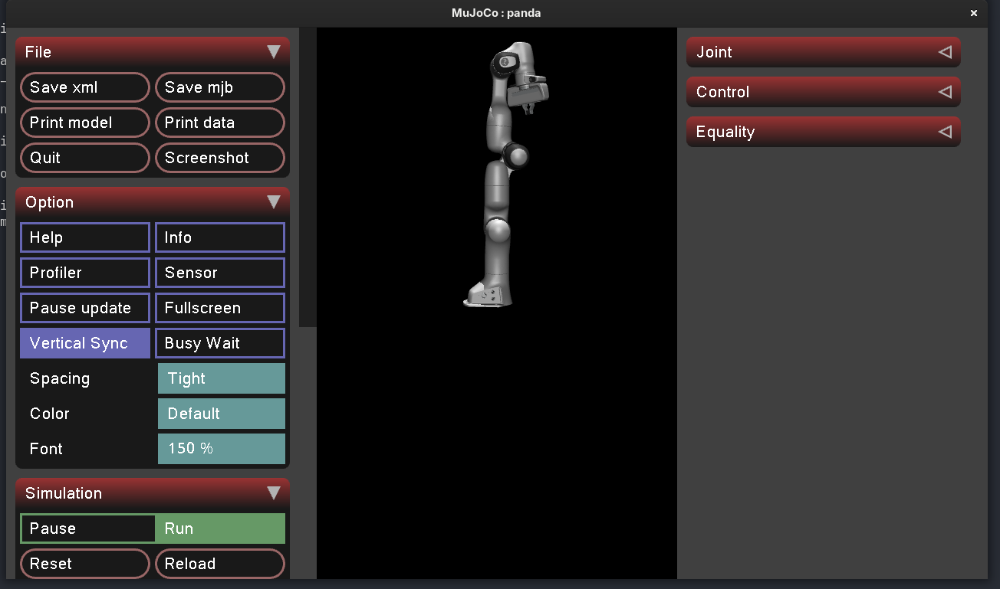
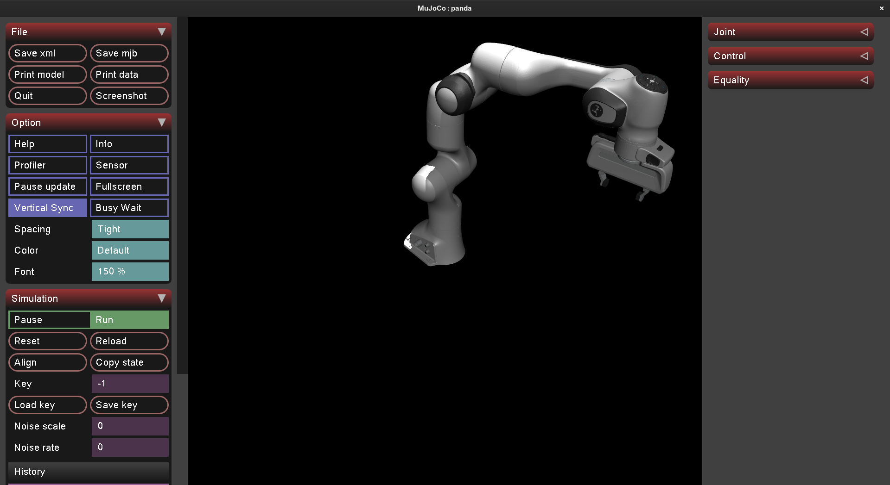

## What I'm trying to achieve

Get oriented in this project, get the repo up, get the log started on
meej.ca, learn about the space. This is my first RL project and I come from
a CV/IL background so this will be hard.

## Thoughts

I need to learn and ship this project fast. As a result, my approach will
be to *de-scope* as much as possible. The question is what makes a solution
to this challenge **more creative** than another? There are a few approaches
to take:

1. The solution has a truly great implementation of RL: punching above your
   weight (for your education/age) is a fantastic way to show intuition and
   creativity.
2. The solution has a unique behaviour: whether it be something quirky or
   useful, coming up with a unique solution to a simple problem is almost by
   definition a creative approach.
3. The content of your presentation is communicated clearly, concisely, and
   in a way that is visually appealing: engineering is not just about
   creating the product, it's also about creating a way to communicate what
   you've done elegantly.

For this 11-day challenge, my goal is to launch a 3D End-Effector Tracking
Arm and communicate each step of the way in a way that's easy to follow. I
will demonstrate the difference between an RL solution and a standard
inverse kinematics / PI control solution, with some commentary on both
approaches.

## Research

To de-scope, I have to ask whether the documentation around the Franka arm
(7DoF) is a greater advantage over the fewer dimensions of the UR5 arm
(6DoF).

> Franka Panda is the de facto default for RL manipulation research, which
> means dozens of public Gymnasium environments, SB3 examples, reward
> functions, and obs designs you can crib from. UR5 has more
> industrial-automation code and less RL-flavored code. The 7th DoF on
> Franka is also irrelevant at the RL level if we use a Cartesian action
> space
>
> (the wrapper handles inverse kinematics under the hood, agent never sees
> joints).

After researching the space a little more with the help of Claude, it makes
sense to go with the option with more documentation, especially considering
**the extra dimension will get baked into our reward system anyway**.

The next natural question is: do we care about the orientation of the tip
of the arm? We want to ship fast, so we can de-scope the problem to ignore
the orientation of the tip of the arm and focus on **position only**.

What is the action space of the RL model?

Well, it's baked into the problem description. It should naturally be the
cartesian end-effector delta. This means we don't care about the arm
joints, we just care about the final position of the tip, and the model
picks how it will move the joints.

What will the reward shape look like?

A standard shape: `||target - current_ee|| - α·||action||`, that second
term is a magnitude penalty for smoothness which we can tune later.

What will our observations look like?

The set of `{ee_pos, ee_vel, target_pos, target_vel, error}`. Keep it
simple for now. The idea is the arm needs to see where it is and where
it's going to go.

What will the RL algo look like?

PPO via SB3, not from scratch... I've heard about these two *tools* in
passing, so it will be a delight to learn more about them as we go along.

## Experiment

### Going through the motions

I'm going to need a virtual environment to do any development, luckily I
just downloaded uv for a course at UBC (CPSC 330, intro to ML). I can
reuse it here to make a new environment for this project.

`uv init rl-arm-tracking` in my `/Projects` directory will do the trick
(I've also added a description). Ok, now we can update the README.md a
little, delete the useless `main.py` for now, and launch the repo using
the GitHub CLI: <a href="https://github.com/amjadya/rl-arm-tracking" target="_blank" rel="noopener noreferrer">github.com/amjadya/rl-arm-tracking</a>, boom.

### Some dependencies

`uv add mujoco numpy matplotlib robot_descriptions`

- `mujoco`: gives us the physics engine we need
- `numpy`: classic array math... MuJoCo state is numpy arrays!
- `matplotlib`: hehe, plots
- `robot_descriptions`: this is a community package with a bunch of
  MJCF/URDF files (Franka is in there)

### The first script

```python
import mujoco
import mujoco.viewer
from robot_descriptions import panda_mj_description


def main() -> None:
    model = mujoco.MjModel.from_xml_path(panda_mj_description.MJCF_PATH)
    data = mujoco.MjData(model)

    mujoco.viewer.launch(model, data)

if __name__ == "__main__":
    main()
```

Why two objects? One has the topology of the Franka arm we have access to
through the `robot_descriptions` package, and `MjData` holds the arm's
**state**.

|             | `MjModel`       | `MjData`                                  |
| ----------- | --------------- | ----------------------------------------- |
| What        | Fixed blueprint | Current state                             |
| Mutates?    | No, ever        | Yes, every step                           |
| Created via | XML parsing     | Memory allocation sized to model          |
| How many    | Usually one     | Can have many, all sharing the same model |

Running `uv run python hello_arm.py` gives us the following:



### A note on the API asymmetry

`MjModel.from_xml_path(...)` is a factory method because there are
multiple ways a model can come into existence (XML file, XML string,
compiled binary). The canonical creation path is "parse this XML file."
Hence the named constructor.

`MjData(model)` is just allocating zeroed-out buffers sized to the
model. There's no parsing involved. MuJoCo looks at `model.nq`,
`model.nv`, `model.nu`, etc., and allocates arrays of that size. So a
plain constructor with `(model)` as the size hint is all that's needed.

Why this matters for our RL pipeline: when we vectorize training (run
many parallel envs to feed the policy), we'll likely have one `MjModel`
(loaded once, slow-ish) and many `MjData` objects (one per env, cheap
to allocate).

### XML keyframe

`mujoco.mj_resetDataKeyframe(model, data, 0)` gives the arm a more
natural pose.



### Getting familiar with the Franka robot arm

Let's print some important features to the terminal so we know what
we're working with:

```text
Model: /home/meej/.cache/robot_descriptions/mujoco_menagerie/franka_emika_panda/panda.xml

njnt = 9 (joints)
nq = 9 (generalized coordinates)
nv = 9 (degrees of freedom)
nu = 8 (actuators)
nbody = 12

Joints:
[0] joint1
[1] joint2
[2] joint3
[3] joint4
[4] joint5
[5] joint6
[6] joint7
[7] finger_joint1
[8] finger_joint2

Actuators:
[0] actuator1
[1] actuator2
[2] actuator3
[3] actuator4
[4] actuator5
[5] actuator6
[6] actuator7
[7] actuator8
```

Nine joints, eight actuators... interesting. It seems that on a real
Franka gripper, the two finger joints are actuated together. Good to
know. We don't really care for this as we won't be using the gripper
for the end-effector trajectory tracking.

Also note, MuJoCo is exposing generalized coords AND degrees of
freedom. This is scary because it implies we're going to have to worry
about quaternions. Flagging this as something to learn more about if
issues come up. (Hopefully my Lagrangian mechanics course can help out
here...)

## Driving questions

- What position should I leave the gripper in?
- To what extent will I have to revisit quaternions in order to simulate the arm physics correctly?
- Does the chosen reward shape `||target − ee|| − α·||action||` actually produce smooth motion, or will it need extra terms (per-axis weighting, derivative)?

## Next

- Write a script that drives the arm's end-effector to a hardcoded 3D point in space using iterative inverse kinematics (Jacobian pseudo-inverse). This is the foundation that gets reused twice: as part of the RL env's Cartesian action wrapper, and as the classical IK+PD baseline.
