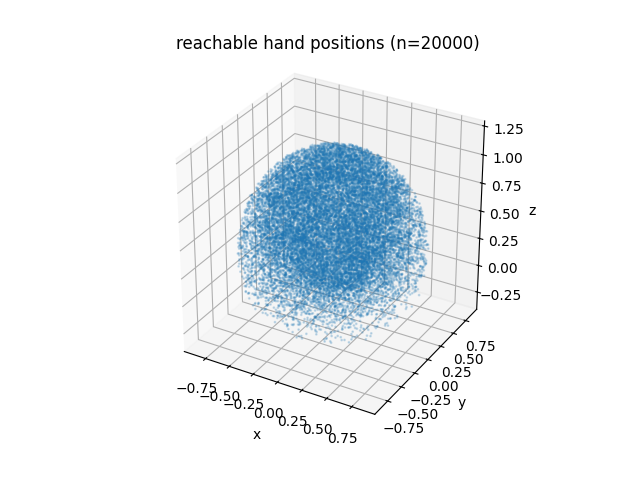
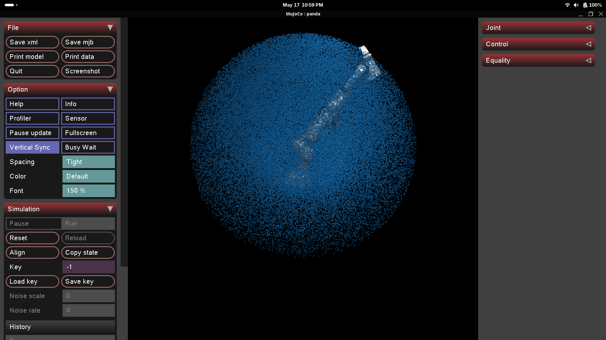
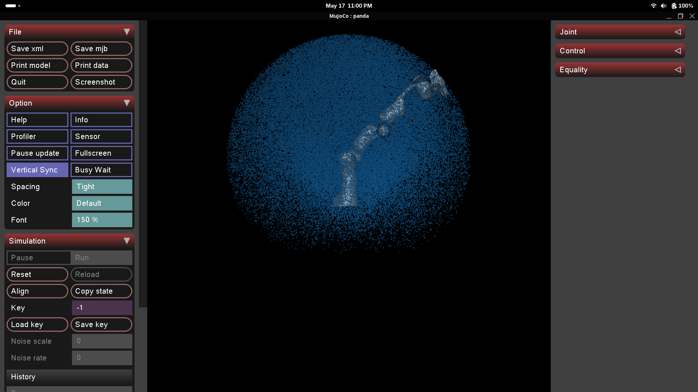

## What I'm trying to achieve

Pick the RL scope for the arm tracking pipeline and lay out the infrastructure
needed to start training.

## Thoughts

### Picking the approach

Last session I mapped out four RL approaches:

|     | Name          | Geometry solved by | Dynamics solved by | Difficulty                              |
| :-- | :------------ | :----------------- | :----------------- | :-------------------------------------- |
| iv  | RL + IK + PD  | IK                 | PD                 | trivial: RL only guides on top          |
| iii | RL + PD       | RL                 | PD                 | medium: RL discovers inverse kinematics |
| ii  | IK + RL       | IK                 | RL                 | medium: RL learns the torque/dynamics   |
| i   | RL end-to-end | RL                 | RL                 | hard: RL learns both                    |

#### Some questions going in:

1. Is there a science for estimating training length per approach?
2. Is approach iv actually trivial? Is it not impressive that the model learns feed-forward?
3. Will training generalise to trajectories the model was not trained on?

#### Answering the questions above:

1. No closed-form formula for RL sample complexity. It is all empirical, but there are reference benchmarks online.
2. With fresh eyes: iv is the right starting point. The plumbing is reusable. Re-scope if time allows.
3. Generalisation depends on the training distribution. Train only on circles and it will not handle lines.

#### Decision

All four approaches share the same reward (`-||target − ee||`). The only difference is the action space: a larger space makes credit assignment harder. Starting with iv keeps the problem tractable.

With fresh eyes, I have decided to start with iv, and expand scope if I have time. Seeing RL learn "feed-forward" would be very satisfying!

### Plan

I plan on making four files. All flat in the home directory until the structure is clear:

1. `trajectory.py`: I'm going to need a *random* trajectory for each episode to train on. I'll have to address *generalisation* in training directly.
2. `env.py`: the Gymnasium environment. It'll have `reset()` which picks a random trajectory and resets the stage, `step(action)` which allows the model to output its 3D Cartesian vector and run the whole IK + PD step afterwards. I'll also declare the observation space and action space here.
3. `train.py`: I'll set up the SB3 PPO, vectorised envs, and save the policy
4. `eval.py`: where we watch what the current policy is up to, and compare it to the classical approach I already built!

Once these four are stable, I'll refactor components into `/core`.

## Experiment

### Chunk 1: Deps

```
uv add stable-baselines3 gymnasium
```
`Gymnasium` is an environment interface. It's just what allows us to separate RL from MuJoCo.

`SB3` is the library of algorithms. It has PPO ready to go for us. It also pulls in `torch` which is the neural-net backend we need to run PPO.

And of course, `uv add` not `pip install` as we're using `pyproject.toml` and `uv.lock` to keep my deps reproducible for when I deliver the project.

### Chunk 2: `trajectory.py`

To write this file, I'll need to understand the shape of the Panda's maximum reach. 
To do this, I'm going to sample hundreds of thousands of different angles across all 7 joints, 
and see where the arm ends up.

See `verify_length.py` in the GitHub.

```
samples: 300000 (15.0s)
reach  min/mean/max : 0.013 / 0.768 / 1.190 m

max reach by cone (within ~45 deg):
  +x fwd  : 1.057 m   -x back : 1.051 m
  +y left : 1.058 m   -y right: 1.060 m
  +z up   : 1.190 m   -z down : 0.458 m
```



The reachable volume is nearly a sphere, truncated below the base.





With these images, I notice that the arm's reach hinges upon that first pitching joint from the base. 
The numbers in that code block above are deceptive because the arm pitches up from this joint.
Recalculating from joint 2 as origin:

```
[from shoulder joint 2 anchor]
reach  min/mean/max : 0.066 / 0.611 / 0.858 m

max reach by cone (within ~45 deg):
  +x fwd  : 0.858 m   -x back : 0.858 m
  +y left : 0.858 m   -y right: 0.858 m
  +z up   : 0.858 m   -z down : 0.817 m
```

Brilliant! Maximum reach from joint 2 is ~0.858 m. This sets the bounds for randomly generated
trajectories.

Requirements for `trajectory.py`:

1. Generate smooth trajectories for the arm to follow.
2. Support non-circular paths.
3. Allow trajectories that extend beyond the 0.858 m radius.
4. Quantify what fraction of the trajectory is within reach: discretise the path and check each
   point's distance from the shoulder against 0.858 m.

## Driving questions

- How can I improve the visualisation's performance? (This will remain open even if I don't write it.)
- How can I improve the visualisation's aesthetics? (This will also remain open.)
- What trajectory shapes should I train on, and in what mix?
- How much does the initial curriculum choice affect learning later on?
- What is the minimum training run that tells me whether the RL setup is working?

## Next

- Finish `trajectory.py`: pick a simple trajectory now and leave a
  template for future types.
