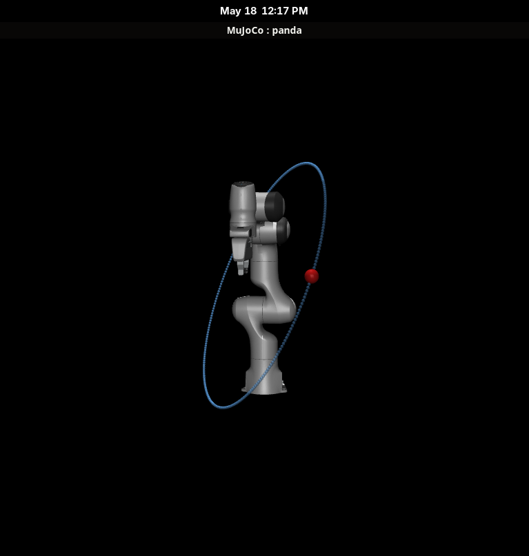
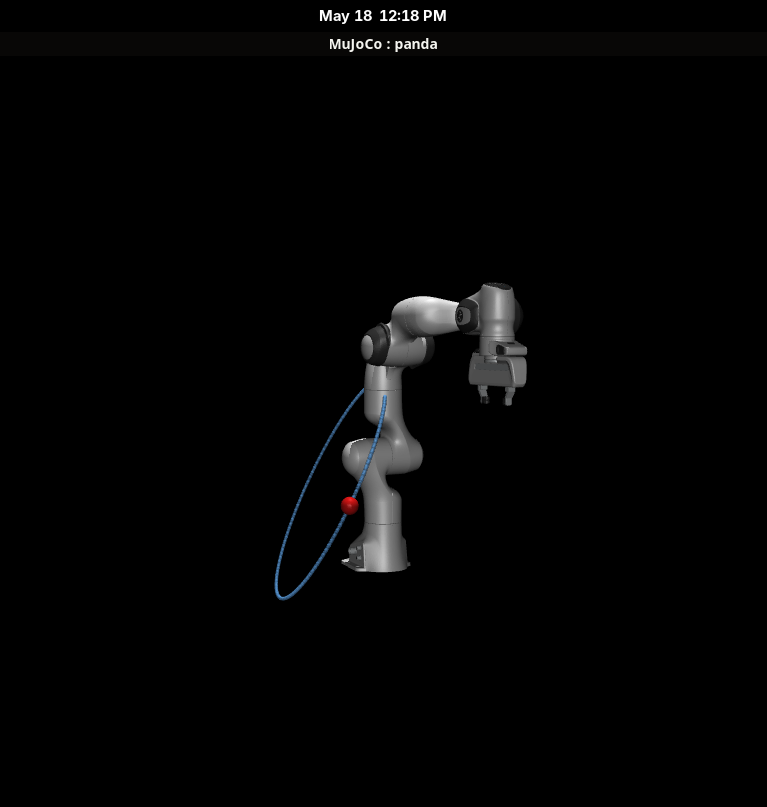
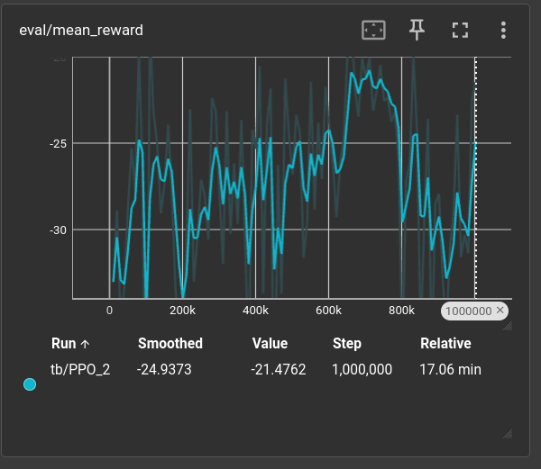
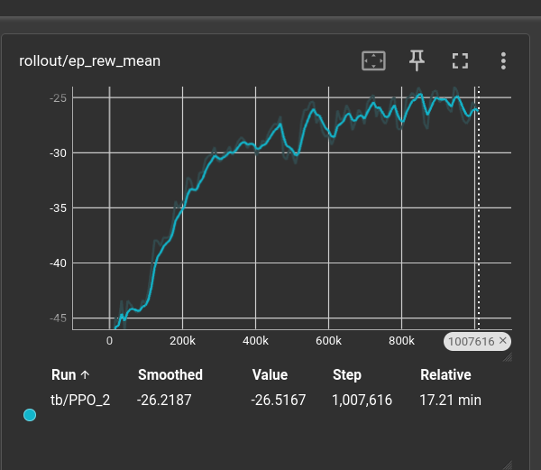

## What I'm trying to achieve

Today's goal is to close out `trajectory.py`, build the three remaining
pipeline files (`env.py`, `train.py`, `eval.py`), train a first policy on the
new infrastructure, and watch it run.

## Research

I have to get stronger with the terminology if I'm going to build anything
useful. Here are the definitions in my own words.

### Markov Decision Process vocabulary

- **Observation space**: the schema for the agent's inputs.
- **Observation**: the current values seen by the agent.
- **State**: the complete state of the system, whether or not the agent can see it.
- **Action**: the agent's output. In our case, a Cartesian vector we call "lead".
- **Reward**: the equation that promotes good behaviour and punishes bad behaviour.
- **Episode**: one full run from start to termination.
- **Transition**: a single step of the simulation, written as `(s, a, r, s')`.
  "I was in state s, took action a, got reward r, and ended up in next-state s'."
- **Return**: the total reward across all transitions in an episode.
- **Discount**: reduces the impact later rewards have on return, and
  mathematically bounds the total reward for long episodes.

### Gymnasium API

Gymnasium is a thin interface that separates the RL algorithm from the
environment. To make a custom env, I declare or implement:

1. `self.observation_space` and `self.action_space` in `__init__`.
2. `reset()`: starts a fresh episode. Puts the environment back in a valid
   starting state and returns the first observation. By the time `reset()` is
   called, the previous episode is already done; it just waits to be reborn.
3. `step(action)`: advances one transition. Returns
   `(obs, reward, terminated, truncated, info)`.

That contract is the whole interface SB3's PPO needs to talk to my env.

**Space**: the shape of valid data. The most common is `Box`:

```python
from gymnasium.spaces import Box
import numpy as np

# A 3D vector where each component is in [-1, 1]
some_space = Box(low=-1.0, high=1.0, shape=(3,), dtype=np.float32)
```

The shape is what matters most. For `observation_space`, the bounds are mostly
informational (SB3 does not clip observations to them). For `action_space`,
the bounds are enforced: the policy's outputs are clipped to that range.

### PPO concepts

- **Policy**: the network that makes decisions. The policy returns a probability distribution over actions. Call it
  twice on the same observation and you get a different result.

- **Value function**: a second network that estimates the expected total
  discounted return from a given state. PPO is an "actor-critic" method: the
  policy is the actor (picks actions), the value function is the critic
  (judges states). The value function provides the baseline used to compute advantage, and trains itself
  separately to predict returns more accurately.

- **Advantage**: the difference between what actually happened and what the
  value function predicted. `advantage = G − V(s)`. This is the interesting
  part of what happened in the episode (better or worse than expected). PPO
  uses positive advantage to encourage actions and negative advantage to
  discourage them.

- **Rollout**: a batch of transitions collected from running the policy. PPO
  collects a rollout, computes advantages, runs several gradient updates on
  it, then throws it away and collects fresh data. Contents:

| Stored              | Needed for                          |
| :------------------ | :---------------------------------- |
| observation s       | feeding through policy + value nets |
| action a            | knowing what was tried              |
| reward r            | computing return / advantage        |
| log_prob of a       | the PPO loss formula                |
| value estimate V(s) | computing advantage                 |

The size of the rollout is a hyperparameter; SB3's PPO default is `2048` per env.

- **On-policy**: an algorithm that can only train on data collected by the
  current policy. Once the weights shift, the stored rollout no longer
  reflects current behaviour and has to be discarded.

## Experiment

### `trajectory.py`

Picking up where last session left off, I started simple: randomly generated
circular trajectories with different centre positions and orientations.



`uv run trajectory.py --show --seed 0`



`uv run trajectory.py --show --seed 10`

Something to think about: what happens when the trajectory passes through the
arm's own body? I'll defer this and treat it as an "unreachable position" for
now.

See <a href="https://github.com/amjadya/rl-arm-tracking/blob/main/trajectory.py" target="_blank" rel="noopener noreferrer">trajectory.py on GitHub</a>.

### `env.py`

Two flags I had to internalise:

- **Terminated**: the episode ended because of a failure or success condition.
- **Truncated**: the episode ran out of time (max steps exceeded).

Two design choices that don't have a "right" answer:

- *How many steps per episode?* By choice: enough to see at least one full
  trajectory loop. I picked 200.
- *How often should the policy make decisions?* By choice: slower than the
  physics loop (500 Hz), faster than a human could react. I picked 100 Hz,
  giving 5 physics ticks per control tick.

The rest of `env.py` fell out naturally once the MDP, Gymnasium, and PPO
concepts above were settled. See <a href="https://github.com/amjadya/rl-arm-tracking/blob/main/env.py" target="_blank" rel="noopener noreferrer">env.py on GitHub</a>.

### `train.py`

The plan for this file:

1. Build vectorised envs.
2. Construct the PPO model.
3. Set up callbacks for logging and evaluation against a validation set.
4. Run training (`model.learn()`).

**Vec env shape:** I have 16 cores, so technically I could go up to 16. Since
I don't know how to set up scheduling yet, I started with 8 and left room to
scale.

A few concepts that fell out of building this:

- **`SubprocVecEnv`** spawns 8 new Python processes, each with its own memory,
  variables, and imports. To run `make_env` inside a subprocess, the
  subprocess imports the module that defines the env. In our case, that's
  `train.py` itself.
- **`if __name__ == "__main__":`** is what stops the multiprocessing from
  re-spawning subprocesses on import and blowing the OS up.
- **The factory pattern** (`make_env()`) is needed because MuJoCo's C
  pointers can't be pickled. We can't ship a pre-built env to a subprocess,
  but we can ship a function that builds one locally.

#### PPO hyperparameters

| Argument | Value | Meaning |
|---|---|---|
| `"MlpPolicy"` | — | Default MLP (two hidden layers of 64 units, tanh activations). Gives us mean, log-std, and value heads. |
| `vec_env` | — | The parallel envs PPO will sample from. |
| `seed` | 42 | PPO's internal RNG. Not related to the env seed. |
| `n_steps` | 1024 | Steps per env per rollout. |
| `batch_size` | 64 | Mini-batch size inside the gradient update. |
| `n_epochs` | 10 | Passes over the rollout per update (`n_envs * n_steps / batch_size = 128` mini-batches per epoch). |
| `gamma` | 0.99 | Discount factor. Bounds the infinite-horizon return and sets the agent's effective planning horizon. |
| `gae_lambda` | 0.95 | Blend between Monte Carlo and bootstrap when estimating G for advantage. Closer to 1 leans Monte Carlo. |
| `learning_rate` | 3e-4 | Scales Adam (PPO's optimiser) to control the size of each weight update. |
| `clip_range` | 0.2 | Hard limit on how much the policy can shift in a single gradient update. |
| `ent_coef` | 0.0 | Entropy pressure. Rewards the policy for staying exploratory. Tune up if it commits to local optima too early. |

#### Callbacks

Two callbacks for logging and saving the best-seen model:

- **`CheckpointCallback`**: periodic full-model snapshots to `./checkpoints/`. Crash insurance.
- **`EvalCallback`**: validates the current policy against five deterministic
  episodes in a separate env (clean of the eight training subprocesses), and
  saves the best-performing checkpoint to `./checkpoints/best/`.

The eval fires five times more often than checkpointing: roughly every six
rollouts I save weights, but I validate the policy almost every rollout.

#### Training run

And that's it. I set `TOTAL_TIMESTEPS = 1_000_000`, added
`tensorboard_log="./logs/tb/"` to the PPO constructor, and pulled in the
extras:

```
uv add tqdm rich tensorboard
```

Through a conversation with Claude, I learned that `tensorboard_log` is one way 
to capture the metrics that diagnose training health:

> - `train/policy_loss`: is the policy actually being pushed by gradients?
> - `train/value_loss`: is V(s) getting better at predicting G?
> - `train/entropy_loss`: how spread out is the policy?
> - `train/approx_kl`: how much did the policy shift per update?
> - `train/clip_fraction`: what % of transitions hit the clip_range cap?
> - `train/explained_variance`: how well does V(s) explain the actual returns? (~1 = great, ~0 = useless).
> - `rollout/ep_rew_mean`: mean training reward (noisy, exploratory).

A smoke test at `TOTAL_TIMESTEPS = 10_000` flagged a warning that PPO with an
MLP policy runs faster on CPU than GPU, so I added `device="cpu"` to the PPO
constructor.

After suppressing the minor warnings:

```bash
uv run python train.py
uv run tensorboard --logdir ./logs/
```

It took 17 minutes.





Not bad: the smoothed `rollout/ep_rew_mean` climbs from -45 to roughly -25 and
plateaus around step 500k. The `eval/mean_reward` is noisier (only five
episodes per evaluation), but reaches a best of **-17.16 ± 3.02 at step
660,000** before settling at **-21.48 ± 6.95 by the end**. Whether this is a
local minimum or the physical floor of the task is the next thing I want to
investigate visually.

See <a href="https://github.com/amjadya/rl-arm-tracking/blob/main/train.py" target="_blank" rel="noopener noreferrer">train.py on GitHub</a>.

### `eval.py`

Only a few lines, and largely similar to work we've done before. See <a href="https://github.com/amjadya/rl-arm-tracking/blob/main/eval.py" target="_blank" rel="noopener noreferrer">eval.py on GitHub</a>.

Otherwise, here's a video of its performance:

<video src="/videos/rl_tracking_demo.mp4" muted controls style="max-height:400px; object-fit:cover"></video>

Even on just 1M steps the feed-forward is visibly learned.

The arm hits itself occasionally. I don't know yet whether this is the RL or
the IK; I'll need to compare trajectories across the classical and RL
controllers before drawing a conclusion. My suspicion is it's IK, not RL.

Two paths to fix it: add a collision penalty to the reward (which would
improve RL tracking over the classical approach even more), or bias the IK
toward solutions less likely to self-collide.

At this stage, I'm ready to add an offset to the end-effector so we can see
it tracking the red ball without the wrist mesh clipping over the
visualisation.

## Driving questions

- How do I get the arm to stop hitting itself? Collision penalty in the
  reward, or IK bias toward less-collision-prone configurations?
- How do I make sure I compare apples to apples between the classical and RL
  controllers, given the agent acts at 100 Hz while IK+PD ran as fast as the
  physics loop (500 Hz)?
- Is `max_lead = 0.15 m` valid given my assumption that trajectories won't
  exceed 2.5 m/s? When does that break?
- What trajectory shapes should I train on next, and in what mix? Only
  circles so far.

## Next

- Compare the feed-forward-trained policy against the classical IK + PD
  controller from the May 15 entry.
- Move the tracked end-effector point to an offset past the wrist so tracking
  is visible without the wrist mesh clipping the marker. Note: this changes
  the EE definition and will require retraining.
