## What I'm trying to achieve

Get a new baseline for the model performance across all new trajectories. Spend today improving both baselines (classical and RL).

## Evaluation


For context, yesterday I introduced new trajectories + a new reward function which
punishes collisions. Below is the last log to terminal:
```txt
Eval num_timesteps=5000000, episode_reward=-36.32 +/- 8.15
Episode length: 200.00 +/- 0.00
-----------------------------------------
| eval/                   |             |
|    mean_ep_length       | 200         |
|    mean_reward          | -36.3       |
| time/                   |             |
|    total_timesteps      | 5000000     |
| train/                  |             |
|    approx_kl            | 0.022495987 |
|    clip_fraction        | 0.21        |
|    clip_range           | 0.2         |
|    entropy_loss         | -0.165      |
|    explained_variance   | 0.582       |
|    learning_rate        | 0.0003      |
|    loss                 | 1.4         |
|    n_updates            | 6100        |
|    policy_gradient_loss | -0.00757    |
|    std                  | 0.259       |
|    value_loss           | 6.11        |
-----------------------------------------
---------------------------------
| rollout/           |          |
|    ep_len_mean     | 200      |
|    ep_rew_mean     | -37.8    |
| time/              |          |
|    fps             | 1047     |
|    iterations      | 611      |
|    time_elapsed    | 4776     |
|    total_timesteps | 5005312  |
---------------------------------
 100% ━━━━━━━━━━━━━━━━━━━━━━━━━━━━━━━━━ 5,005,312/5,000,000  [ 1:19:34 < 0:00:00 , 1,079 it/s ]
```

1. `explained_variance` is pretty low (0.582)... the model hasn't really learned what it's supposed to do yet.
2. `entropy_loss` at -0.165 means the model stopped exploring... not great because it doesn't seem to have found the optimal minimum.
3. `std` at 0.259 checks out with entropy being so low, the model acts consistently.

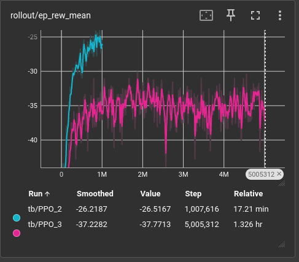

Oh dear, the penalty we added has changed our reward floor. Maybe the new trajectories carry too much information for the simple default PPO (two layers of 64x64 neurons) to handle.

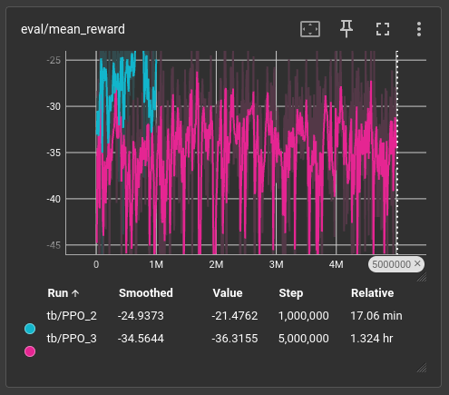

And we're performing in the evaluation set much worse too. I know this is very noisy, and I'm struggling to decide whether to rewrite the eval callback in `train.py` to be deterministic.

### First, let's get our metrics


```txt
❯ uv run python metrics.py
n=10 pairs  duration=5.00s
────────────────────────────────────────────────────────────────────────────
Metric                          Classical (μ±σ)      RL+Lead (μ±σ)        Δμ
────────────────────────────────────────────────────────────────────────────
Mean error (cm)                   10.70 ±  3.12       9.49 ±  2.75     -1.21
RMSE error (cm)                   15.91 ±  5.56      15.20 ±  5.48     -0.71
Max error (cm)                    82.26 ± 30.58      82.25 ± 30.57     -0.01
Time in 5cm band (%)              24.10 ± 24.02      32.74 ± 23.89     +8.64
Err in-reach (cm)                 10.73 ±  3.12       9.51 ±  2.75     -1.22
Err out-of-reach (cm) (2/10)       6.17 ±  0.25       6.45 ±  0.92     +0.28
Jerk RMS (m/s³)                  458.98 ± 196.36     517.24 ± 226.80    +58.25
```

Oof... very unhappy with this. It's performing better at leading than the classical approach, but super jerky! (Saving the best model from this pass first to the archive as `v2`.)

After watching it run live and comparing directly with my eyes:

```fish
# RL policy, random mix (best representation of capability)
uv run python eval.py

# Classical (IK+PD with DLS by default)
uv run python ikpd.py
```

It's actually not clear which one is worse. The new trajectories are difficult for `ikpd.py` too. Extending `metrics.py` to show me a per seed, per shape breakdown (new `--breakdown` flag):

```txt
Per-seed:
  seed  shape   Classical (cm)  RL+Lead (cm)       Δ
  0     fly              14.03         12.91   -1.12
  1     fig8              8.06          7.57   -0.49
  2     fly              13.78         11.92   -1.86
  3     fly              13.42         11.58   -1.84
  4     fly              14.15         12.39   -1.76
  5     fly               9.10          8.11   -0.98
  6     fig8              4.33          3.72   -0.61
  7     fly              10.04          8.65   -1.39
  8     fly              11.71         10.65   -1.06
  9     fig8              8.33          7.38   -0.95

=== FIG8 (n=3) ===
────────────────────────────────────────────────────────────────────────────
Metric                          Classical (μ±σ)      RL+Lead (μ±σ)        Δμ
────────────────────────────────────────────────────────────────────────────
Mean error (cm)                    6.91 ±  1.83       6.22 ±  1.77     -0.69
RMSE error (cm)                    8.70 ±  2.70       8.30 ±  2.90     -0.40
Max error (cm)                    42.54 ± 17.95      42.54 ± 17.96     +0.00
Time in 5cm band (%)              42.27 ± 33.16      50.33 ± 35.15     +8.07
Err in-reach (cm)                  6.97 ±  1.88       6.27 ±  1.80     -0.70
Err out-of-reach (cm) (1/3)        5.92 ±  0.00       5.53 ±  0.00     -0.40
Jerk RMS (m/s³)                  322.31 ± 220.06     396.62 ± 304.46    +74.31

=== FLY (n=7) ===
────────────────────────────────────────────────────────────────────────────
Metric                          Classical (μ±σ)      RL+Lead (μ±σ)        Δμ
────────────────────────────────────────────────────────────────────────────
Mean error (cm)                   12.32 ±  1.91      10.89 ±  1.72     -1.43
RMSE error (cm)                   19.00 ±  3.04      18.16 ±  3.17     -0.84
Max error (cm)                    99.28 ± 15.24      99.27 ± 15.21     -0.02
Time in 5cm band (%)              16.31 ± 12.30      25.20 ±  9.82     +8.89
Err in-reach (cm)                 12.34 ±  1.93      10.90 ±  1.73     -1.44
Err out-of-reach (cm) (1/7)        6.41 ±  0.00       7.37 ±  0.00     +0.96
Jerk RMS (m/s³)                  517.56 ± 151.30     568.93 ± 157.63    +51.37
```

I see what's happening. The eval noise is likely due to sampling more fly shapes than easier circle shapes. The bottleneck is the fly trajectory, it's too hard right now, and I don't have a curriculum which slowly introduces harder trajectories to the RL model. This might be the next best thing to try. Also, let's see why that 99cm blowup happened in seed 8, let's see what went wrong:

```fish
uv run python eval.py --seed 8 --model archive/best_model_v2.zip
```

Oh, nothing to worry about, if anything that was really good:

<video src="/videos/seed-8-far-target-snap.mp4" muted controls style="max-height:400px; object-fit:cover"></video>

The target just spawns really far away from the `ee`, but the model snaps to it very well.

### Before we carry on

I shouldn't consider building a curriculum or making hyper-parameter optimizations yet. I'm going to rerun the training without the penalty we added to compare the reward floors. I want to see if the penalty is making things better or worse. I added a penalty alongside new trajectories, which I should have isolated.

Here it is again at completion (took 1 hour):

Training performance:

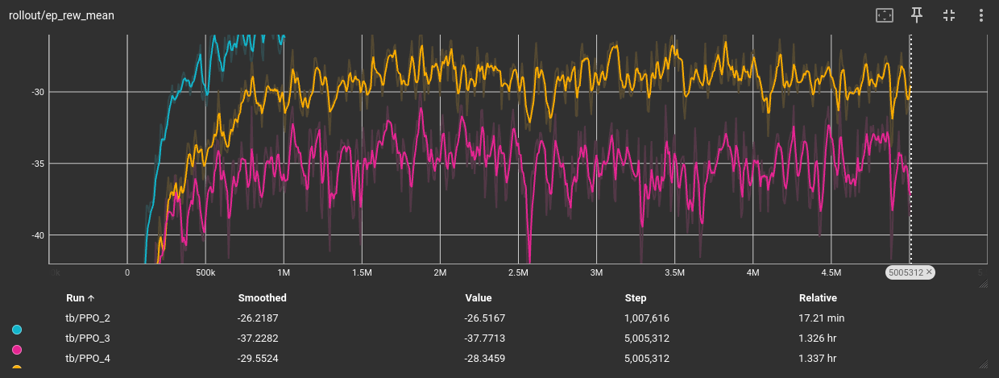

Random 5 trajectories eval performance:

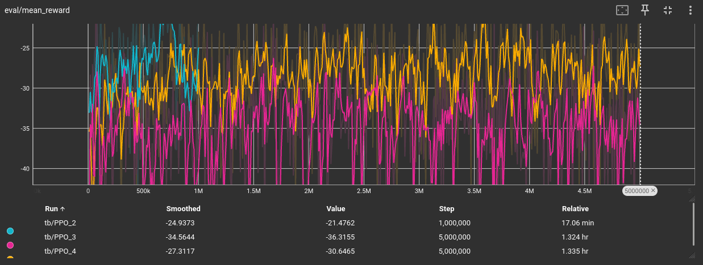

 The eval reward jumped 13 points (-36 → -23).The gap to yesterday's 
 circle-only baseline is ~2 reward. This is probably trajectory difficulty not 
 policy weakness. Still noticing a plateau... I wonder if I should increase entropy.

 Anyways, here are some more detailed stats:


```txt
❯ uv run python metrics.py --breakdown --prefix-a eval_v2 --prefix-b eval_v3 --label-a "RL v2" --label-b "RL v3"
=== ALL (n=10) ===
────────────────────────────────────────────────────────────────────────────
Metric                              RL v2 (μ±σ)        RL v3 (μ±σ)        Δμ
────────────────────────────────────────────────────────────────────────────
Mean error (cm)                   10.43 ±  4.21       7.70 ±  1.80     -2.73
RMSE error (cm)                   16.58 ±  8.23      13.77 ±  5.11     -2.81
Max error (cm)                    82.25 ± 30.57      82.27 ± 30.59     +0.01
Time in 5cm band (%)              30.36 ± 25.63      49.26 ± 14.92    +18.90
Err in-reach (cm)                 10.45 ±  4.20       7.71 ±  1.81     -2.74
Err out-of-reach (cm) (2/10)       6.45 ±  0.92       4.77 ±  1.27     -1.68
Jerk RMS (m/s³)                  542.72 ± 227.03     725.28 ± 260.82   +182.56

Per-seed:
  seed  shape       RL v2 (cm)    RL v3 (cm)       Δ
  0     fly              12.91          9.56   -3.35
  1     fig8              7.57          7.32   -0.25
  2     fly              11.92          8.69   -3.24
  3     fly              11.58          7.58   -4.00
  4     fly              12.39          9.07   -3.32
  5     fly               8.11          7.57   -0.55
  6     fig8              3.72          3.86   +0.14
  7     fly               8.65          8.05   -0.60
  8     fly              20.05         10.01  -10.04
  9     fig8              7.38          5.33   -2.05

=== FIG8 (n=3) ===
────────────────────────────────────────────────────────────────────────────
Metric                              RL v2 (μ±σ)        RL v3 (μ±σ)        Δμ
────────────────────────────────────────────────────────────────────────────
Mean error (cm)                    6.22 ±  1.77       5.50 ±  1.42     -0.72
RMSE error (cm)                    8.30 ±  2.90       7.44 ±  2.53     -0.86
Max error (cm)                    42.54 ± 17.96      42.58 ± 18.02     +0.04
Time in 5cm band (%)              50.33 ± 35.15      56.73 ± 22.82     +6.40
Err in-reach (cm)                  6.27 ±  1.80       5.48 ±  1.42     -0.79
Err out-of-reach (cm) (1/3)        5.53 ±  0.00       6.04 ±  0.00     +0.51
Jerk RMS (m/s³)                  396.62 ± 304.46     555.10 ± 342.73   +158.48

=== FLY (n=7) ===
────────────────────────────────────────────────────────────────────────────
Metric                              RL v2 (μ±σ)        RL v3 (μ±σ)        Δμ
────────────────────────────────────────────────────────────────────────────
Mean error (cm)                   12.23 ±  3.62       8.65 ±  0.89     -3.58
RMSE error (cm)                   20.13 ±  7.16      16.48 ±  3.17     -3.65
Max error (cm)                    99.27 ± 15.21      99.27 ± 15.29     +0.00
Time in 5cm band (%)              21.80 ± 12.82      46.06 ±  7.77    +24.26
Err in-reach (cm)                 12.24 ±  3.62       8.66 ±  0.90     -3.58
Err out-of-reach (cm) (1/7)        7.37 ±  0.00       3.50 ±  0.00     -3.87
Jerk RMS (m/s³)                  605.33 ± 144.35     798.22 ± 170.62   +192.89
```

Not bad! More jerky, but that doesn't necessarily mean less smooth... might just be fitting to jerkier paths.

#### ikpd vs without penalty

```txt
❯ uv run python metrics.py --breakdown --prefix-a ikpd --prefix-b eval_v3 --label-a "Classical" --label-b "RL v3"
=== ALL (n=10) ===
────────────────────────────────────────────────────────────────────────────
Metric                          Classical (μ±σ)        RL v3 (μ±σ)        Δμ
────────────────────────────────────────────────────────────────────────────
Mean error (cm)                   10.70 ±  3.12       7.70 ±  1.80     -2.99
RMSE error (cm)                   15.91 ±  5.56      13.77 ±  5.11     -2.14
Max error (cm)                    82.26 ± 30.58      82.27 ± 30.59     +0.00
Time in 5cm band (%)              24.10 ± 24.02      49.26 ± 14.92    +25.16
Err in-reach (cm)                 10.73 ±  3.12       7.71 ±  1.81     -3.02
Err out-of-reach (cm) (2/10)       6.17 ±  0.25       4.77 ±  1.27     -1.40
Jerk RMS (m/s³)                  458.98 ± 196.36     725.28 ± 260.82   +266.30

Per-seed:
  seed  shape   Classical (cm)    RL v3 (cm)       Δ
  0     fly              14.03          9.56   -4.47
  1     fig8              8.06          7.32   -0.75
  2     fly              13.78          8.69   -5.10
  3     fly              13.42          7.58   -5.84
  4     fly              14.15          9.07   -5.08
  5     fly               9.10          7.57   -1.53
  6     fig8              4.33          3.86   -0.47
  7     fly              10.04          8.05   -1.98
  8     fly              11.71         10.01   -1.70
  9     fig8              8.33          5.33   -3.00

=== FIG8 (n=3) ===
────────────────────────────────────────────────────────────────────────────
Metric                          Classical (μ±σ)        RL v3 (μ±σ)        Δμ
────────────────────────────────────────────────────────────────────────────
Mean error (cm)                    6.91 ±  1.83       5.50 ±  1.42     -1.41
RMSE error (cm)                    8.70 ±  2.70       7.44 ±  2.53     -1.26
Max error (cm)                    42.54 ± 17.95      42.58 ± 18.02     +0.04
Time in 5cm band (%)              42.27 ± 33.16      56.73 ± 22.82    +14.47
Err in-reach (cm)                  6.97 ±  1.88       5.48 ±  1.42     -1.48
Err out-of-reach (cm) (1/3)        5.92 ±  0.00       6.04 ±  0.00     +0.11
Jerk RMS (m/s³)                  322.31 ± 220.06     555.10 ± 342.73   +232.79

=== FLY (n=7) ===
────────────────────────────────────────────────────────────────────────────
Metric                          Classical (μ±σ)        RL v3 (μ±σ)        Δμ
────────────────────────────────────────────────────────────────────────────
Mean error (cm)                   12.32 ±  1.91       8.65 ±  0.89     -3.67
RMSE error (cm)                   19.00 ±  3.04      16.48 ±  3.17     -2.52
Max error (cm)                    99.28 ± 15.24      99.27 ± 15.29     -0.01
Time in 5cm band (%)              16.31 ± 12.30      46.06 ±  7.77    +29.74
Err in-reach (cm)                 12.34 ±  1.93       8.66 ±  0.90     -3.68
Err out-of-reach (cm) (1/7)        6.41 ±  0.00       3.50 ±  0.00     -2.91
Jerk RMS (m/s³)                  517.56 ± 151.30     798.22 ± 170.62   +280.66
```

And as we expect to see, much better tracking but still jerkier.

## A grand realization

The model's observations are linear. It has no memory and can't see how velocity changes.
I need to add acceleration to the observation space. This should be a huge win for RL. 

The issue is now we're kind of comparing apples to oranges. 
We're not giving IK a chance to analytically find the right value to use
for the lead. In order to show off how much better RL over purely analytical 
solutions with the same observations, I need to introduce noise. 
RL should learn a Kalman-filter style smoothing factor whereas IKPD will
certainly jitter with noise. (Going to see how much time I have left first.)

### Another test with a non-zero entropy coefficient `ent_coef=0.01`

```txt
Eval num_timesteps=4998000, episode_reward=-35.01 +/- 7.48
Episode length: 200.00 +/- 0.00
-----------------------------------------
| eval/                   |             |
|    mean_ep_length       | 200         |
|    mean_reward          | -35         |
| time/                   |             |
|    total_timesteps      | 4998000     |
| train/                  |             |
|    approx_kl            | 0.012672591 |
|    clip_fraction        | 0.113       |
|    clip_range           | 0.2         |
|    entropy_loss         | -5.12       |
|    explained_variance   | 0.864       |
|    learning_rate        | 0.0003      |
|    loss                 | 0.308       |
|    n_updates            | 4060        |
|    policy_gradient_loss | -0.0125     |
|    std                  | 1.35        |
|    value_loss           | 1.77        |
-----------------------------------------
---------------------------------
| rollout/           |          |
|    ep_len_mean     | 200      |
|    ep_rew_mean     | -36.2    |
| time/              |          |
|    fps             | 1160     |
|    iterations      | 407      |
|    time_elapsed    | 4308     |
|    total_timesteps | 5001216  |
---------------------------------
```

Oh dear oh dear...

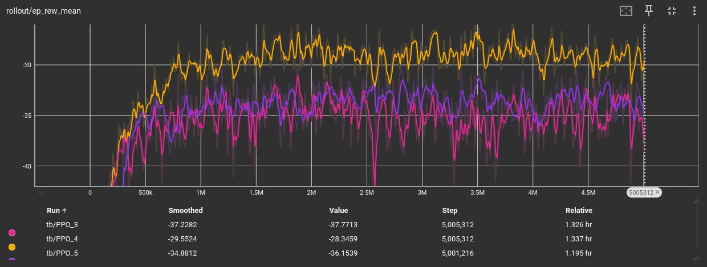

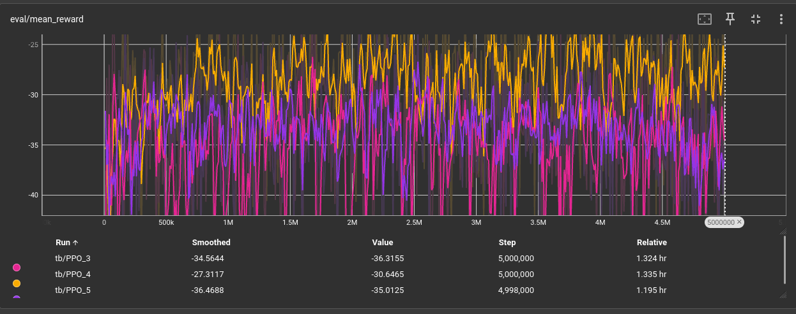

Ok so... exploration was not the bottleneck. This tells us `v3` has found the natural reward ceiling with our current configuration.

## Recap & alignment

We've tested improving exploration. We've tested adding a penalty. 
We watched the reward ceiling change as we added new trajectories. 

At this stage, we see RL `v3` beats the classical method by a decent margin, 
but I'm not satisfied. Especially since the arm is a little jerky and 
still hitting itself often.

Here are our current observations:

`env.py _get_obs()`:

```python
return np.concatenate([ee_pos, ee_vel, target_pos, target_vel])
```

where each comes from:

| field        | source                              | how                                                      |
| :----------- | :---------------------------------- | :------------------------------------------------------- |
| `ee_pos`     | MuJoCo runtime                      | `data.site_xpos[tip_id]`. true position after `mj_step`. |
| `ee_vel`     | finite difference                   | `(ee_pos - prev_ee_pos) / control_dt`                    |
| `target_pos` | precomputed trajectory              | `Trajectory.pos[i]`: set when traj was generated         |
| `target_vel` | analytical, set by trajectory maker | each maker computes velocity in closed form              |

`target_vel` specifics:

- circle: r·ω·[-sin, cos, 0] rotated into world. Exact derivative.
- fig8: size·ω·[cos(s), cos(2s), 0] rotated. Exact derivative.
- fly: vel_local / seg_duration, analytical derivative of the Catmull-Rom spline.

### Let's give the model acceleration

Currently it knows the current velocity of the object which helps it lead, but not the acceleration. I'm going to give it an analytical acceleration for all three trajectory types `circle, fig8, and fly` and see if this boosts it even more.

I updated `eval.py, ikpd.py, and env.py` to accept this new shape of `trajectory.at()`.

### Let's fix our evaluation set

I want it to be a large set of random, consistent trajectories we sample against as the model trains. I don't like the idea of 5 random spot tests anymore. The idea was to test the model on a small sample of new trajectories to see if it's getting any better without leaking information into training.

Something has to give though, because accidentally sampling 5 super easy trajectories makes our model look amazing in a state where it might still have growth potential.

I'm changing our evaluation to happen 5 times less often, but use 5 fixed trajectories from each flight type. This will let us monitor training more easily, and we can test against new data in the test set, so we don't overfit.

`v5` is now trainin'! Should take an hour, I'm going to the gym.

(One hour later...)


Results:

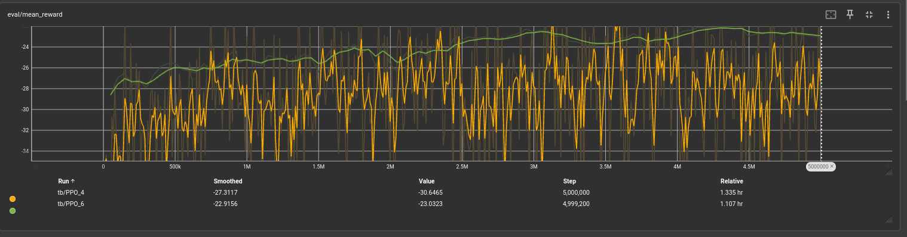

Mean eval reward vs `v3`. Notice our evaluation is smooth and steady climbing now, very good. But this doesn't mean the model is doing better necessarily yet.

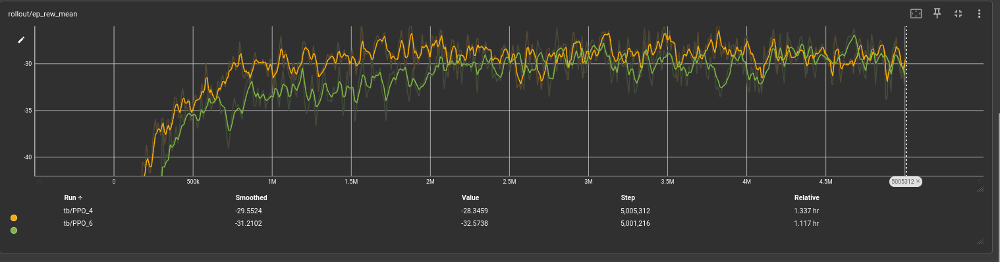

Notice the reward ceiling is the same, this is reassuring as increasing the observation space shouldn't reduce the amount of rewards we can get unless the observations overwhelm the neurons in the network (which clearly they are not).

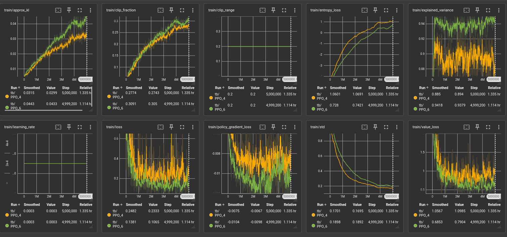

Lots of extra data I'm just logging here for future reference.

This time, I'm hungry for data. I want to sample 100 different 
seeds and run a stronger ikpd vs rl comparison. (See below for how this model performs in the test set.)

## Where do all 5 versions land?

Pulled together everything we've measured across the 5 trained models so far. Each row reports each version's improvement *over classical* on its native eval set. Not directly comparable across rows because the eval sets and sample sizes differ.

| Ver | Change                                                   | Eval  | mean err Δ vs classical | in-band Δ  |
| --- | -------------------------------------------------------- | ----- | ----------------------- | ---------- |
| v1  | 1M steps, circles only, pre-tip-site EE                  | n=10  | **−3.77 cm**            | +15.06 pp  |
| v2  | 5M, +collision penalty, +fig8+fly, +tip site             | n=10  | **−1.21 cm**            | +8.64 pp   |
| v3  | 5M, −penalty (isolated)                                  | n=10  | **−3.00 cm**            | +25.16 pp  |
| v4  | 5M, +ent_coef=0.01 (exploration test)                    | —     | not benchmarked         | —          |
| v5  | 5M, +acceleration in obs                                 | n=100 | **−4.55 cm**            | +27.54 pp  |

Caveats:
- **v1's number uses the pre-tip-site EE definition.** Not on the same yardstick as v2+.
- **v2 and v3 share the same 10 seeds** (no circles). v3 beats v2 by 1.79 cm on that mix: a clean head-to-head.
- **v5 is the only run on 100 seeds covering all three shapes.**

We can't run v1-v4 against v5 on the same 100 seeds: they were trained with a **12D observation space** (pos, vel, target_pos, target_vel), and v5 expanded that to **15D** by adding target_acc.

Here's a video of the current state of things:

<video src="/videos/v5-vs-ikpd-leading.mp4" muted controls style="max-height:400px; object-fit:cover"></video>

Left is the ikpd and right is the v5 model trained on acceleration. The rl model has learned to lead the target, but both systems struggle in the same way:

**collisions.**

Some of these trajectories are unreachable, they go inside the body of the arm. Others are clearly reachable, but the warm-started IK has no concept of its own body. The jacobian just helps it solve for the right position every time.

### What about a quick patch using cold start?

<video src="/videos/cold-start-thrash.mp4" muted controls style="max-height:400px; object-fit:cover"></video>

Absolutely not. This causes the model to thrash around. Although it was slightly better at avoiding collisions, this was not the solution.

More and more I'm leaning towards letting RL learn the entire geometry and avoid doing IK altogether... I'm so tempted. I think I could do it but I have this midterm coming up.

OMG, the idea of using the lead to avoid collisions can work if I:

1. give the model all 7 angles and velocities
2. terminate early if the model hits itself

This is better than the penalty, the punishment is much stricter and won't affect the reward ceiling. This is also better because the model can now learn which angles cause strange IK behaviour, and hopefully even if small, this will make a noticeable difference in the number of collisions. A clear win over the classical approach! If this works, I'm going to pivot all my efforts to fixing the extra jerkiness (probably with just a super small action delta penalty) and then to presentation and getting this ready for submission.

I would have loved to try replacing all of IK with RL, but as an introductory project to this space, I'm really proud.

(Two hours later...)

## The classic mistake...

So... I built what I was talking about above. 
Issue is the reward is purely negative, and I have a termination condition. 

The model is suiciding........

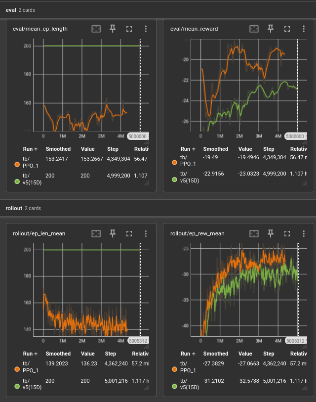

Average runs 25% shorter than the episode duration. I haven't seen footage of it yet,
 but it's clearly racing to terminate early to avoid future negative rewards from being 
 alive.

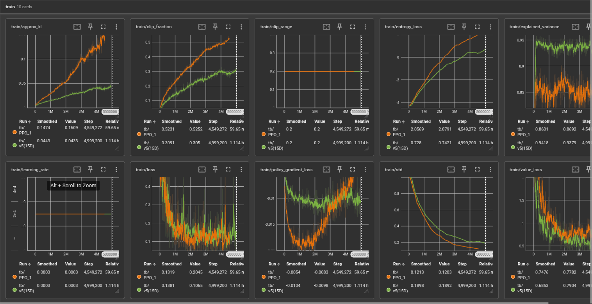

<video src="/videos/rl-self-collision-thrash.mp4" muted controls style="max-height:400px; object-fit:cover"></video>

There it is... ending tracking early. So jittery, the lead is only allowed within a 15cm range. RL is barely in control of the arm and yet it's using whatever minimal control it has to thrash around and hope it hits itself.

### A quick patch?

```python
if terminated:
    reward -= 50.0
```

This one line in `env.py` should be enough to stop it from learning termination.

After retraining:

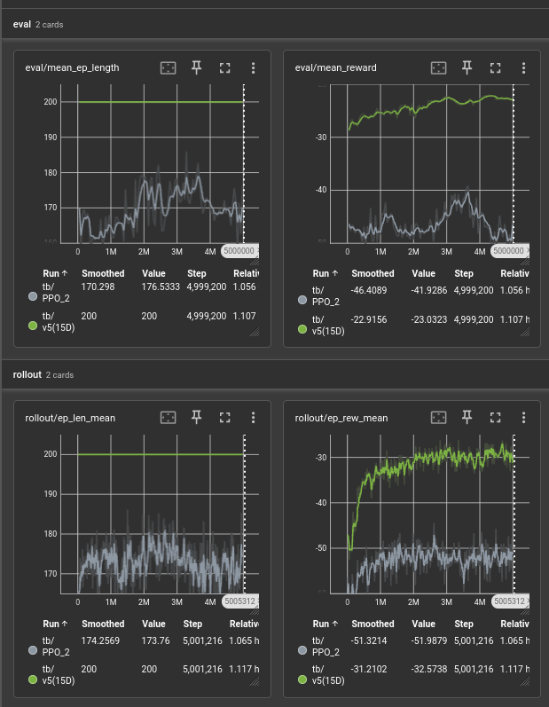

Based on `mean_ep_length` alone I know it didn't work.

<video src="/videos/still-hitting-itself.mp4" muted controls style="max-height:400px; object-fit:cover"></video>

Yep, still rewarded for hitting itself. 
 I guess the model can still learn to give up if the scope of future work is too 
 difficult.

### A quick patch attempt two

I'm going to try rewarding it for being alive, proportionally to how close it is to the object.

```diff
+        tracking_reward = float(np.exp(-distance / self.tracking_scale))
         reward = (
-            -distance
+            tracking_reward
             - self.alpha * float(np.linalg.norm(action))
             - self.collision_k * penetration
         )
```

After starting training and monitoring... I decided to end this early:

```txt
Eval num_timesteps=3049512, episode_reward=74.52 +/- 38.70
Episode length: 166.20 +/- 47.77
----------------------------------------
| eval/                   |            |
|    mean_ep_length       | 166        |
|    mean_reward          | 74.5       |
| time/                   |            |
|    total_timesteps      | 3049512    |
| train/                  |            |
|    approx_kl            | 0.06680674 |
|    clip_fraction        | 0.371      |
|    clip_range           | 0.2        |
|    entropy_loss         | -0.41      |
|    explained_variance   | 0.933      |
|    learning_rate        | 0.0003     |
|    loss                 | 0.452      |
|    n_updates            | 2480       |
|    policy_gradient_loss | -0.0193    |
|    std                  | 0.278      |
|    value_loss           | 4.17       |
----------------------------------------
---------------------------------
| rollout/           |          |
|    ep_len_mean     | 173      |
|    ep_rew_mean     | 58.7     |
| time/              |          |
|    fps             | 1275     |
|    iterations      | 249      |
|    time_elapsed    | 2398     |
|    total_timesteps | 3059712  |
---------------------------------
```

3M steps in and the average eval length is 166 steps. It's not learning to avoid itself. It started around this range too.

Taking a break to digest everything I learned today.

## Driving questions

- Within the bounds of a reasonable lead, can the model even learn to avoid itself?
- We know the IK is hurting the model, however I estimate 50M steps to convergence (10 hour training) before I can teach the model to replace IK... how can we reduce the impact of IK on the collisions without ripping it out entirely?
- Should I stop this approach and fine tune `v5`?
- What happens to `v5` if I give it the extra 14D I gave `v6` and `v7` without changing the reward function?

## Next

- In the current state, the best next stage is to take some time to think things over.
- Come back to this after my midterm!
- Let's see if I can reduce jitter for the RL approach.
