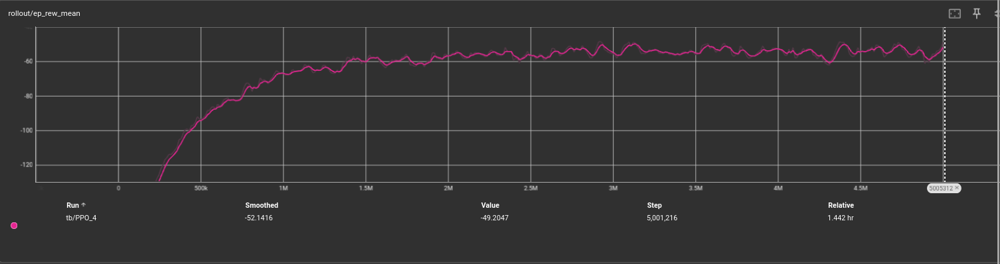
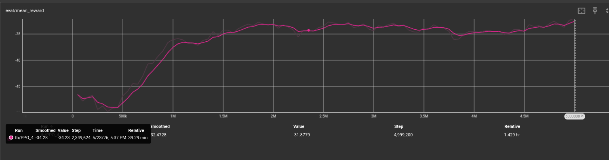

## What I'm trying to achieve

I want to fix jitter today! I'm going to add an action delta penalty and also change the training to have longer durations. This should patch up the jitter issues we saw in the last log.

## Experiment

Here's the action delta penalty I'm adding.

```python
action_delta_norm = float(np.linalg.norm(action - self.prev_action))
reward = (
    -distance
    - self.alpha * float(np.linalg.norm(action))
    - self.beta * action_delta_norm
    - self.collision_k * penetration
)
```

Super simple. You might be wondering how I chose beta. I want to remind you of this:

```
=== ALL (n=200) ===
────────────────────────────────────────────────────────────────────────────
Metric                          Classical (μ±σ)        RL v5 (μ±σ)        Δμ
────────────────────────────────────────────────────────────────────────────
Mean error (cm)                   12.26 ±  6.66       8.28 ±  4.50     -3.97
RMSE error (cm)                   17.27 ±  8.40      14.39 ±  6.94     -2.88
Max error (cm)                    76.66 ± 27.25      76.62 ± 27.42     -0.04
Time in 5cm band (%)              24.06 ± 30.22      54.17 ± 26.26    +30.11
Err in-reach (cm)                 12.27 ±  6.66       8.26 ±  4.47     -4.01
Err out-of-reach (cm) (22/200)      12.44 ±  9.58      10.47 ±  8.00     -1.97
Jerk RMS (m/s³)                  520.68 ± 317.94     773.06 ± 388.80   +252.38
Lead norm (mean)                   0.00 ±  0.00       0.65 ±  0.25     +0.65
Lead Δ norm (mean)                 0.00 ±  0.00       0.04 ±  0.02     +0.04
Lead Δ norm (p95)                  0.00 ±  0.00       0.13 ±  0.08     +0.13
Tracking lag (ms)                113.45 ± 11.90      17.65 ± 33.79    -95.80
Err at best lag (cm)               4.67 ±  4.80       7.86 ±  4.20     +3.18
```

Let's take a look at what the current per-step reward is:

| Term                                    | Per-step magnitude       |
| :-------------------------------------- | :----------------------- |
| -distance                               | ≈ -0.083 (8.28 cm / 100) |
| -alpha × &#124;&#124;action&#124;&#124; | ≈ -0.0065 (0.01 × 0.65)  |
| Existing total per step                 | ≈ -0.09                  |
*(Alpha is set to 0.01 right now.)*
*(Collision penalty coefficient is zero right now.)*

This means, on average, we accumulate -0.09 in rewards per step.

Now, `||Δaction|| distribution: mean=0.04, p95=0.13`.

Let's try and target the punishment to be within 5%-15% of the distance penalty:

  - 5% of distance term = 0.004 per step
  - mean ||Δaction|| = 0.04
  - beta = 0.004 / 0.04 = 0.1

At p95 → 0.1 × 0.13 = 0.013 → ~15% of distance. So we set beta to 0.1!

### A note of concern

In the past, I was training the model on 2s episodes, and testing against 5s ones. What happens if I train on 5s episodes? You can argue introducing the action delta penalty and increasing training length is confounding, especially since it will change the speed of the fly trajectory:

```python
    seg_duration = duration / n_seg
```

where `duration` was set to 2s before (derived from 200 steps in `env.py` which I have now changed to 500 steps).

Hard to say... I'll have more insight post-training.

### I want a larger validation set

I'm increasing `seeds_per_shape` in train.py to 8 (from 5). This will probably add like 30 minutes to my training time but I want more confidence in the policy we're calling **the best** in `v9`.

Okay, here goes.

(Waiting for retraining)

## The results

```
New best mean reward!
---------------------------------
| rollout/           |          |
|    ep_len_mean     | 500      |
|    ep_rew_mean     | -49.2    |
| time/              |          |
|    fps             | 962      |
|    iterations      | 407      |
|    time_elapsed    | 5197     |
|    total_timesteps | 5001216  |
---------------------------------
 100% ━━━━━━━━━━━━━━━━━━━━━━━━━━━━━━━━━━━ 5,001,216/5,000,000  [ 1:26:36 < 0:00:00 , 476 it/s ]

rl-arm-tracking on  main [!⇡] is 📦 v0.1.0 via 🐍 v3.14.4 took 1h26m49s
❯
```

Woah, woah, woah... it was still breaking records on the last few steps?!

Should I keep training?





Is that a last-second breakthrough?

```fish
cp checkpoints/best/best_model.zip archive/old_models/best_model_v9.zip
```

Saving this immediately.

### Comparison, v9 vs v5 vs classical

First up, v9 against the classical IK+PD baseline on 200 trajectories:

```
=== ALL (n=200) ===
────────────────────────────────────────────────────────────────────────────
Metric                          Classical (μ±σ)        RL v9 (μ±σ)        Δμ
────────────────────────────────────────────────────────────────────────────
Mean error (cm)                   12.26 ±  6.66       7.24 ±  4.44     -5.01
RMSE error (cm)                   17.27 ±  8.40      14.48 ±  7.08     -2.79
Max error (cm)                    76.66 ± 27.25      76.70 ± 26.87     +0.04
Time in 5cm band (%)              24.06 ± 30.22      73.04 ± 21.07    +48.99
Err in-reach (cm)                 12.27 ±  6.66       7.22 ±  4.42     -5.05
Err out-of-reach (cm) (22/200)      12.44 ±  9.58       8.57 ±  8.69     -3.87
Jerk RMS (m/s³)                  520.68 ± 317.94     576.67 ± 331.49    +56.00
Lead norm (mean)                   0.00 ±  0.00       0.56 ±  0.20     +0.56
Lead Δ norm (mean)                 0.00 ±  0.00       0.02 ±  0.01     +0.02
Lead Δ norm (p95)                  0.00 ±  0.00       0.07 ±  0.03     +0.07
Tracking lag (ms)                113.45 ± 11.90      16.85 ± 31.84    -96.60
Err at best lag (cm)               4.67 ±  4.80       6.77 ±  3.97     +2.10
```

Time in the 5cm band jumped from 24% to **73%**. The jerk gap to classical basically closed (+11% over classical, was +48% for v5). And the lag stayed crushed at 17 ms.

#### Error breakdown

| Metric | Classical | RL v9 | Δ |
| :--- | :--- | :--- | :--- |
| Mean error | 12.26 | 7.24 | -5.01 cm |
| In-band (%) | 24% | 73% | +49 pp |
| Tracking lag | 113 ms | 17 ms | -96 ms |
| Err at best lag | 4.67 | 6.77 | +2.10 cm |
| Jerk RMS | 521 | 577 | +56 |

Decomposing total error:

- Classical mean 12.26: ~7.6 cm of that is **pure lag**
- RL v9 mean 7.24: only ~0.5 cm is lag; the rest is shape error

So v9 still wins the same way v5 did (eliminate the lag penalty), but now does it with a cleaner shape too. The shape error dropped from 7.86 → 6.77 cm vs v5.

Now the part I really care about, v9 head-to-head against v5 on the same exact 200 trajectories:

```
=== ALL (n=200) ===
────────────────────────────────────────────────────────────────────────────
Metric                              RL v5 (μ±σ)        RL v9 (μ±σ)        Δμ
────────────────────────────────────────────────────────────────────────────
Mean error (cm)                    8.28 ±  4.50       7.24 ±  4.44     -1.04
RMSE error (cm)                   14.39 ±  6.94      14.48 ±  7.08     +0.09
Max error (cm)                    76.62 ± 27.42      76.70 ± 26.87     +0.08
Time in 5cm band (%)              54.17 ± 26.26      73.04 ± 21.07    +18.87
Err in-reach (cm)                  8.26 ±  4.47       7.22 ±  4.42     -1.04
Err out-of-reach (cm) (22/200)      10.47 ±  8.00       8.57 ±  8.69     -1.90
Jerk RMS (m/s³)                  773.06 ± 388.80     576.67 ± 331.49   -196.38
Lead norm (mean)                   0.65 ±  0.25       0.56 ±  0.20     -0.09
Lead Δ norm (mean)                 0.04 ±  0.02       0.02 ±  0.01     -0.01
Lead Δ norm (p95)                  0.13 ±  0.08       0.07 ±  0.03     -0.06
Tracking lag (ms)                 17.65 ± 33.79      16.85 ± 31.84     -0.80
Err at best lag (cm)               7.86 ±  4.20       6.77 ±  3.97     -1.09
```

Lead Δ p95 dropped 46%. That's the direct target of the beta penalty, exactly what I wanted to see.

Jerk RMS dropped 25%. That's the downstream effect: smoother actions, smoother arm motion.

I was worried the smoothness penalty would force the model to give up some tracking accuracy for jitter reduction. Apparently not, as `v9` is smoother and more accurate.

### Per-step reward breakdown (v9)

Same format as before. v9 stats: mean error = 7.24 cm, lead norm mean = 0.56, lead Δ norm mean = 0.02.

| Term                                              | Per-step magnitude       |
| :------------------------------------------------ | :----------------------- |
| -distance                                         | ≈ -0.072 (7.24 cm / 100) |
| -alpha × &#124;&#124;action&#124;&#124;           | ≈ -0.0056 (0.01 × 0.56)  |
| -beta × &#124;&#124;Δaction&#124;&#124;           | ≈ -0.002 (0.1 × 0.02)    |
| **New total per step**                            | **≈ -0.080**             |

Compared to v5's -0.090 per step, v9 is -0.010 cheaper per step.

The beta term is the smallest contributor (-0.002 per step) but that's because it did all its work shaping the policy to make smoother actions.

### Addressing the earlier concern

I flagged a confounding variable earlier as my "note of concern" because I changed two things at once (beta penalty AND training duration). Worth revisiting now that I have data.

The duration change only affects **fly** trajectories. Circles and fig8s sample their period from a fixed range independent of episode length, so they're untouched by the 2s → 5s change. If duration was secretly doing the work I'm attributing to beta, I'd expect fly to show massive jitter improvements and circle/fig8 to barely move.

Instead, lead Δ p95 dropped roughly the same amount across all three shapes:

- circle: 0.14 → 0.07 (-50%)
- fig8: 0.11 → 0.06 (-45%)
- fly: 0.15 → 0.08 (-47%)

Circle and fig8 jitter cannot be explained by the duration change. That has to be beta.

### What I'm taking away

v9 beats v5 on every single metric. It also closes most of the smoothness gap to classical without losing the lead advantage. The beta penalty + matched train/eval durations were the right changes.

I'm shipping v9 as the submission model.

## Side-by-side video

Here's a long comparison of IKPD vs v9!

<video src="/videos/v9-vs-ikpd-side-by-side.mp4" muted controls style="max-height:400px; object-fit:cover"></video>

On the left you can see the purely classical tracking arm, and on the right you can see the RL policy learning to lead the arm to reach the target more consistently.

## Driving questions

- How much of the collisions can be improved with a purely RL + PD policy?
- How much time could I save in training if I switch to MuJoCo Warp and JAX?
- This was so fun! What's should I try doing next?

## Next

- Clean the GitHub repo and complete my application!
- Make one final log to release tomorrow and comment on the experience / future scope of work.
